# System Architecture

Loopless uses a layered architecture where each layer has a clear
responsibility. The separation boundary is:

    MICROLOOP = "What happened?"    (detection)
    LOOPLESS  = "What should we do?" (decision + intervention)

## Architecture Diagram

```mermaid
flowchart TB
    subgraph Agent["AGENT FRAMEWORKS"]
        LG[LangGraph]
        CA[CrewAI]
        OA[OpenAI Agents]
        HP[HTTP Proxy]
    end

    subgraph Adapters["FRAMEWORK ADAPTERS"]
        A1[deadband-adapter-langgraph]
        A2[deadband-adapter-crewai]
        A3[deadband-adapter-openai]
    end

    subgraph Core["deadband-core"]
        direction TB
        OR[Orchestrator]
        subgraph Pipe["Observation Pipeline"]
            ED[ExactDetector]
            SD[SemanticDetector]
            RD[RuleDetector]
            HD[HistoryDetector]
        end
        PE[Policy Engine]
        M[RecoveryMetrics]
        R[Replayer]
        H[HistoryStore]
    end

    subgraph Obs["deadband-observation"]
        E[ToolCallEvent]
        Det[Detector trait]
        C[Canonical / Auto-inference]
        Rep[DetectionReport]
    end

    subgraph Microloop["microloop (external dep)"]
        HT[HistoryTracker]
        RE[RuleEngine]
        CI[Canonical + Auto-inference]
    end

    subgraph CLI["deadband-proxy / deadband-cli"]
        CP[Proxy: SSE parsing, Tool Discovery]
        CL[Legacy CLI: trace, replay, inspect]
    end

    subgraph Python["python/deadband"]
        PO[PyOrchestrator]
        PI[PyIntervention]
        PR[PyDetectionReport]
    end

    LG --> A1
    CA --> A2
    OA --> A3
    HP --> OR

    A1 --> OR
    A2 --> OR
    A3 --> OR

    OR --> Pipe
    OR --> PE
    OR --> M
    OR --> H

    ED --> Det
    SD --> Det
    RD --> Det
    HD --> Det

    Det --> E
    Det --> Rep

    ED ---> HT
    SD ---> HT
    RD ---> RE
    C ---> CI

    CL --> OR
    PO --> OR
    PI --> OR
    PR --> Rep

    style Agent fill:#1a1a2e,stroke:#e94560
    style Adapters fill:#16213e,stroke:#0f3460
    style Core fill:#0f3460,stroke:#e94560
    style Obs fill:#16213e,stroke:#533483
    style Microloop fill:#1a1a2e,stroke:#533483
    style CLI fill:#16213e,stroke:#0f3460
    style Python fill:#16213e,stroke:#0f3460
```

## Data Flow

1. An agent makes a **tool call** through a framework (LangGraph, CrewAI, etc.)
2. The **framework adapter** intercepts the call and creates a `ToolCallEvent`
3. The **Orchestrator** receives the event:
   a. Stores it in the bounded **history store** (default: 100 entries)
   b. Runs the **observation pipeline** (all detectors)
   c. If detections fire, evaluates **policies** against them
   d. Returns an **Intervention** (or None if no loop detected)
4. The **adapter** executes the intervention (or downgrades unsupported actions)

## Separation Boundary

| Layer | Responsibility | Location |
|-------|----------------|----------|
| **Microloop** | Detection engine (HistoryTracker, RuleEngine, Canonical) | `../microloop` (crate dependency) |
| **deadband-observation** | Detector trait, pipeline, events, auto-inference | `crates/deadband-observation/` |
| **deadband-core** | Orchestrator, policy, intervention, replay, metrics | `crates/deadband-core/` |
| **Adapters** | Framework-specific wrappers | `crates/deadband-adapter-*/` |
| **CLI** | Command-line interface | `cli/` |
| **Python** | PyO3 bindings | `python/deadband/` |
